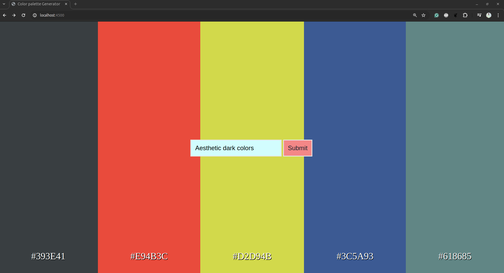

# Color Code Generator 

---

### Welcome to this Color Code Generator project using chatGPT API.
In this project, Colors are being generated by putting description to the ChatGPT from JavaScript app and closest colors are generated.

#### Requirements:
* Python, JavaScript
* Flask, chatGPT API, HTML-CSS
* Pycharm/Vs Code

#### To Set up the project-
You can execute this project either in Docker or local python env

##### To start in local in 
* set up conda/virtual env- **Python 3.12.0**
* clone the project-
```commandline
    github.com
```

* Install all requirements
```commandline
    pip install -r requirement.txt
```
* Create an .flaskenv file and paste below values
```commandline
    FLASK_APP = app
    FLASK_DEBUG=1
    OPENAI_API_KEY= "YOUR API KEY"
```
* To get the API, visit below URL\
    [ChatGPT API](https://platform.openai.com/api-keys)

* To run the project-
```commandline
  flask run --port <PORT NUMBER>
```
##### To start in Docker
Build the Image-
```commandline
        docker build -t color-code-generator .
```
To run in development mode in background-
```commandline
    docker run -d -p 4500:4500 -w /app -v "$(pwd):/app" color-code-generator
```
* Open Swagger-
```commandline
    http://localhost:4500/swagger-ui
```


* Access the pages-
```commandline
http://localhost:4500
```



